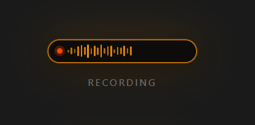

# Kaira

Free, open-source voice dictation for your desktop. Press a hotkey, speak, and your words get pasted into any app.

Built with Python and OpenAI Whisper. Costs about $0.10/month in API fees instead of $15/month for tools like Wispr Flow.

## How It Works

1. Press **Ctrl+Win** (or click the floating widget)
2. Speak
3. Press **Ctrl+Win** again to stop
4. Your words are transcribed and pasted into whatever app is focused

The floating pill widget sits above your taskbar and shows the current state:

<p align="center">
  &nbsp;&nbsp;
  &nbsp;&nbsp;
  &nbsp;&nbsp;
  
</p>

## Why Kaira Exists

I was using Wispr Flow for voice dictation but hit the weekly limit on the free tier after 14 days. The paid plan is $15/month ($12/month annual). I realised I could build my own using OpenAI's Whisper API for a fraction of the cost.

A typical month of casual dictation costs about $0.10 in API fees (around R2 in South Africa). That's not a typo.

## Setup

### Requirements

- Python 3.12+
- Windows 10/11 (Mac and Linux support coming)
- An OpenAI API key

### Install

```bash
git clone https://github.com/billywellington/kaira.git
cd kaira
python -m venv .venv
.venv\Scripts\activate
pip install -r requirements.txt
```

### Configure

```bash
cp .env.example .env
```

Open `.env` and paste your OpenAI API key:

```
OPENAI_API_KEY=sk-your-key-here
```

Don't have one? Get it at [platform.openai.com/api-keys](https://platform.openai.com/api-keys). You'll need to add a few dollars of credit.

### Run

```bash
python voice_dictation.py
```

A small circle appears above your taskbar. You're ready to dictate.

### Auto-Start on Boot (Windows)

Copy `start-silent.vbs` to your Startup folder:

1. Press **Win+R**, type `shell:startup`, hit Enter
2. Create a shortcut to `start-silent.vbs` in that folder

Kaira will launch silently every time you log in.

## Controls

| Action | What It Does |
|--------|-------------|
| **Ctrl+Win** | Start / stop dictation |
| **Click the widget** | Start / stop dictation |
| **Ctrl+Shift+Q** | Quit Kaira |

## Widget States

- **Idle** -- Small circle with a dim dot
- **Hover** -- Expands to show "Ctrl+Win" hint
- **Recording** -- Pulsing red dot + live waveform bars
- **Transcribing** -- Spinner + "Transcribing..." text
- **Done** -- Brief flash, returns to idle

## How Much Does It Cost?

Whisper API pricing: **$0.006 per minute** of audio.

| Usage | Kaira (Whisper API) | Wispr Flow | Aqua Voice | Dragon |
|-------|-------------------|------------|------------|--------|
| Monthly cost | $0.10 - $1.00 | $15/mo | $10/mo | $15/mo |
| Annual cost | $1.20 - $12.00 | $144/yr ($12/mo) | $96/yr ($8/mo) | $180/yr |

**Kaira cost breakdown:**

| Your usage | Monthly API cost |
|-----------|-----------------|
| Casual (a few minutes/day) | ~$0.10 |
| Regular (10 min/day) | ~$1.80 |
| Heavy (30 min/day) | ~$5.40 |

Even at heavy daily use, Kaira costs less than half of the cheapest subscription alternative.

## Tech Stack

- **Python 3.12** -- core runtime
- **PyQt6 + QPainter** -- transparent floating overlay widget
- **OpenAI Whisper API** -- speech-to-text transcription
- **sounddevice** -- microphone recording
- **pynput** -- global hotkey detection
- **pyperclip** -- clipboard and paste

The overlay uses DWM per-pixel alpha compositing (not color-key transparency), which works reliably on Intel UHD and other integrated graphics on Windows 11.

## Known Limitations

- **Windows only** for now. The overlay uses Windows-specific DWM APIs. The backend (recording, transcription, paste) is cross-platform. Mac/Linux contributions welcome.
- **Requires internet** -- Whisper API is cloud-based. Offline mode (local Whisper) is a future goal.
- **English optimised** -- Whisper supports many languages but Kaira currently defaults to English. Easy to change in the code.

## Project Structure

```
kaira/
  voice_dictation.py    # Main app -- overlay + backend
  requirements.txt      # Python dependencies
  .env.example          # API key template
  start-silent.vbs      # Windows auto-start script
  test_keys.py          # Hotkey diagnostic tool
  how-it-works.txt      # Technical deep-dive
  logs/                 # Created at runtime (gitignored)
    audio/              # Saved recordings (7-day retention)
```

## Contributing

Issues, PRs, and feedback welcome. If you get it working on Mac or Linux, I'd love a PR.

## License

MIT

## Author

Built by [Billy Wellington](https://github.com/billywellington) in Cape Town, South Africa.
